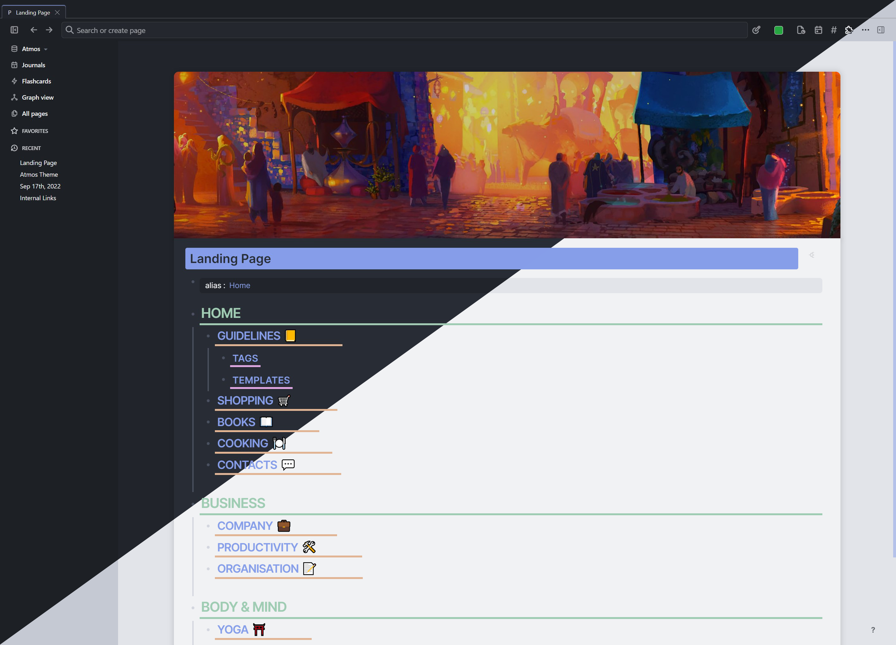
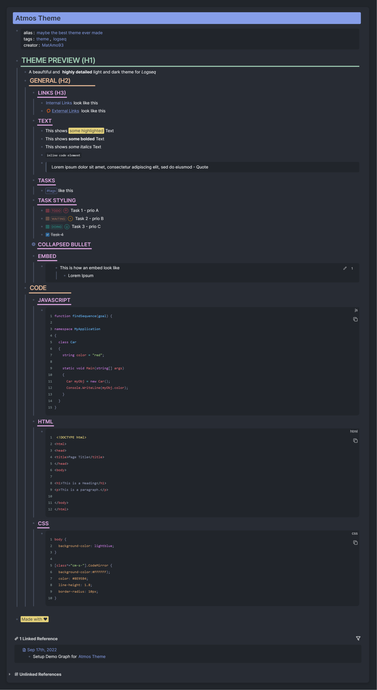
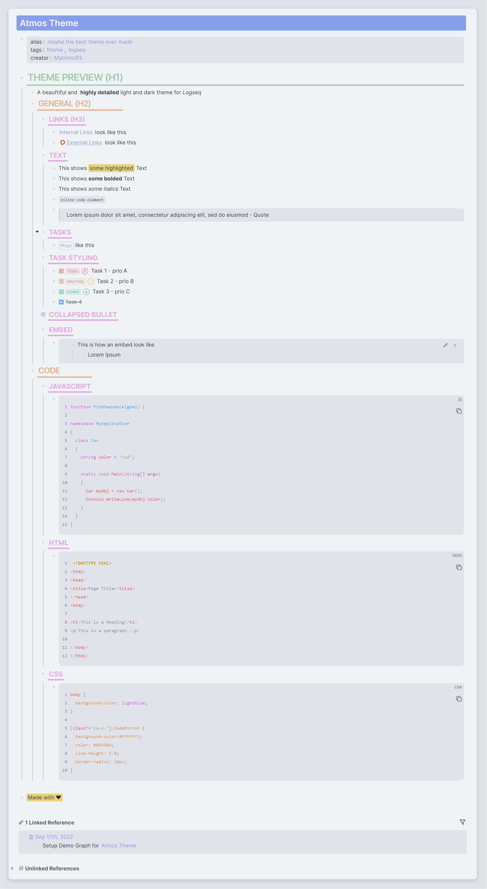

<!-- markdownlint-disable MD033 MD041 -->

  

<h1 align="center">Logseq Atmos Theme</h1>

Atmos theme for <a href="https://logseq.com/">Logseq</a>.

<b>Now in Marketplace!</b> You can install it via <b>Plugins -> Marketplace -> Themes</b>.

## Screenshots

| Preview                                |
| ------------------------------------- |
|  |

| Dark                                | Light                                       |
| ----------------------------------- | ------------------------------------------------- |
|  |  |

## Recommended Plugins for optical improvement
- Banners
- Bullet Threading

## Support

If you have any questions, issues or feature request, use the issue submission on GitHub: https://github.com/Mat4m0/logseq-atmos-theme/issues

## License

MIT

## Credits

Thanks to 
- Yurii Piskun for building solarized extended, providing the advanced css template to built on
- One Dark Pro Theme for inspiriation

Made with love ♥
