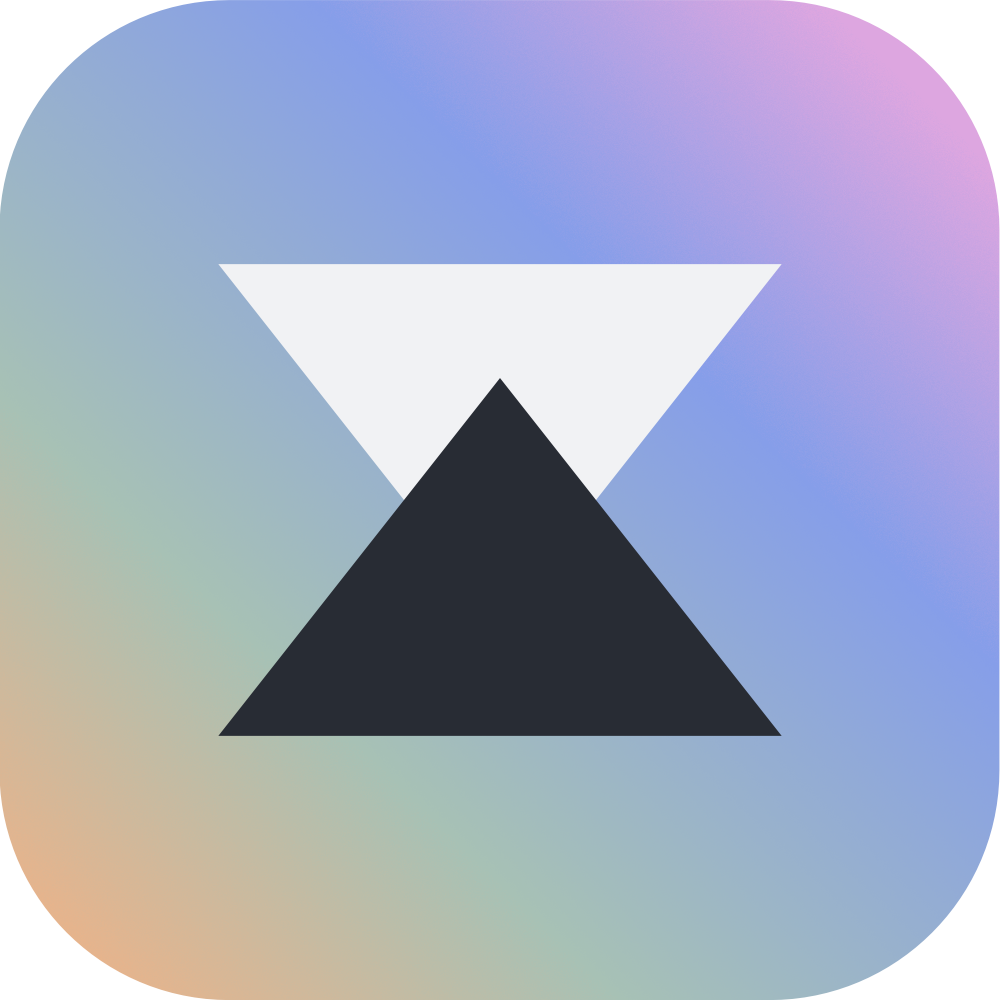

<!-- markdownlint-disable MD033 MD041 -->

<p align="center">
  
</p>
<h1 align="center">Logseq Atmos Theme</h1>

<p align="center">Atmos theme for <a href="https://logseq.com/">Logseq</a>.</p>
<p align="center"><b>Now in Marketplace!</b> You can install it via <b>Plugins -> Marketplace -> Themes</b>.</p>

## Screenshots

| Light                                 |
| ------------------------------------- |
|  |

| Dark                                | Dark Dimmed                                       |
| ----------------------------------- | ------------------------------------------------- |
|  |  |

## Manual Installation

Here's how to install manually (But in most cases you don't need to do this):

### Offline

Download the theme (e.g. `light.css`) into your notes folder and rename it to `logseq/custom.css`.

### Online

Paste this line to your `logseq/custom.css`:

```css
@import url('https://cdn.jsdelivr.net/gh/g1eny0ung/logseq-github-theme@master/light.css');
```

Or paste this line to your `logseq/config.edn`:

```edn
{
  :custom-css-url "@import url('https://cdn.jsdelivr.net/gh/g1eny0ung/logseq-github-theme@master/light.css');"
}
```
## Recommended Plugins for optical improvement
- Solarized Ext
- Banners
- Tabs
- Bullet Threading

## License

MIT

## Credits

Thanks to 
- Yurii Piskun for providing the advanced css template to built on
- One Dark Pro Theme for inspiriation

Made with love ♥
